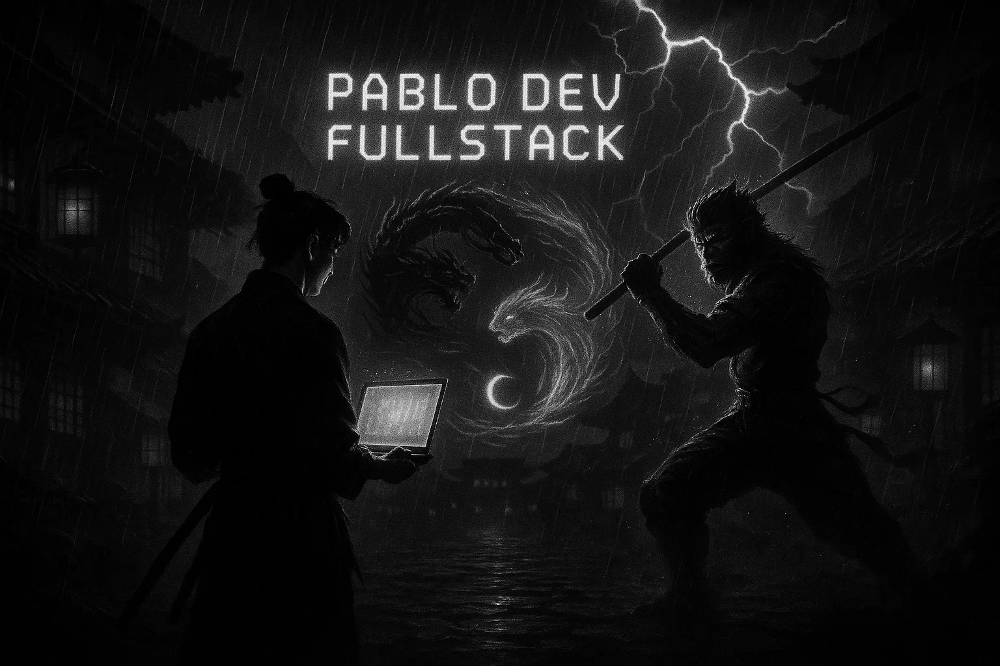

  

<table>
  <tr>
    <td>
      
    </td>
    <td>
      <h3>Sobre mim</h3>
      <strong>Pablo Martins</strong> 
      Ambientes serenos, mente focada, atitude intensa. 
      Inspirado pela estética oriental — preto, vermelho e chuva — busco disciplina, equilíbrio e evolução em tudo que faço. 
      Transformo desafios em aprendizado e compartilho experiências para inspirar quem também busca crescer. 
      <strong>Explore, conecte-se e mantenha o foco: o caminho é feito de propósito!</strong>
    </td>
  </tr>
</table>

  <em>Serenidade para pensar, intensidade para agir. 
  Disciplina para vencer, equilíbrio para crescer.</em>

---

  <strong>💻🌧️ Aqui, o código flui como chuva: tranquilo, focado e em constante evolução.</strong>

---

### 🔭 **O que você vai encontrar aqui**
- Projetos pessoais com pegada inovadora
- Ferramentas de automação e produtividade
- Dicas de desenvolvimento, estudos e foco

💡 Sinta-se à vontade para explorar, contribuir ou simplesmente aprender!

---

## 🚀 Skills
## 🚀 Skills

  
  
  
  
  
  
  
  
  
  

---

### 🌐 **Conecte-se comigo**

  
  
  

---

<!-- Personalize os links de imagem/banner e redes sociais conforme sua preferência! -->
