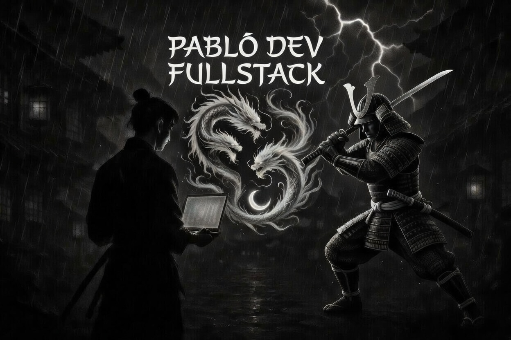

  

---

  <em>Serenidade para pensar. Intensidade para agir. 
  Disciplina para evoluir. Consistência para vencer.</em>

---

## 👨‍💻 Sobre mim

**Pablo Martins**  

Desenvolvedor Full Stack Júnior focado em construção de APIs, automação e sistemas escaláveis.

Tenho como base a disciplina do **Kaizen (melhoria contínua)** e o conceito **Shu-Ha-Ri (aprendizado progressivo)** — aplicando consistência e evolução constante na minha jornada como desenvolvedor.

💡 Transformo problemas em soluções práticas  
🚀 Busco evolução técnica todos os dias  
🌧️ Código limpo, mente focada, execução consistente  

---

## 🔭 O que você vai encontrar aqui

- 🚀 Projetos Full Stack (Node.js, Python, APIs REST)
- ⚙️ Ferramentas de automação
- 📚 Estudos práticos de programação
- 💡 Conteúdo voltado para evolução como dev

---

## 🚀 Skills

### 💻 Linguagens

  
  
  

### 🌐 Front-end

  
  

### ⚙️ Back-end

  
  

### 🗄️ Banco de Dados

  

### 🛠️ Ferramentas

  
  
  

---

## 🌐 Conecte-se comigo

  
  
  

---

  <strong>💻 Aqui o código não é só escrito — ele evolui.</strong> 
  <em>Explore, aprenda e construa junto.</em>

