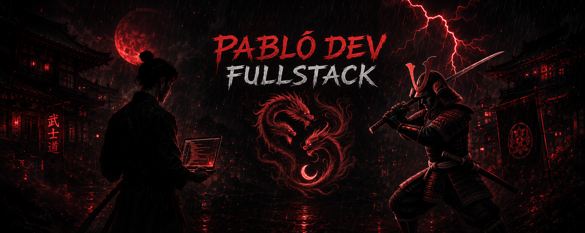

🟣 Pablo Martins | Full Stack Developer

  

 <em>Serenidade para pensar. Intensidade para agir.  Disciplina para evoluir. Consistência para vencer.</em> 

👨‍💻 Sobre mim

Pablo Martins
Desenvolvedor Full Stack Júnior focado em construção de APIs, automação e sistemas escaláveis.

Baseado em princípios de evolução contínua como Kaizen e aprendizado progressivo no modelo Shu-Ha-Ri, aplico consistência e disciplina na construção de soluções reais.

💡 Transformo problemas em soluções práticas
🚀 Evolução técnica constante
⚙️ Código limpo, arquitetura pensada, execução objetiva

🧠 Filosofia de Desenvolvimento
🔴 Evolução contínua acima de perfeição
⚫ Simplicidade como forma mais alta de sofisticação
🔴 Consistência vence talento sem disciplina
⚫ Sistemas devem ser escaláveis e previsíveis
📊 GitHub Analytics (Sistema Vivo)

 <picture> <source media="(prefers-color-scheme: dark)" srcset="https://raw.githubusercontent.com/PabloMartins031/PabloMartins031/pacman-output/pacman-contribution-graph-dark.svg"> <source media="(prefers-color-scheme: light)" srcset="https://raw.githubusercontent.com/PabloMartins031/PabloMartins031/pacman-output/pacman-contribution-graph.svg">  </picture> 

🧬 Tecnologias
💻 Linguagens

    

🌐 Front-end

    

⚙️ Back-end

    

🗄️ Banco de Dados

  

🛠️ Ferramentas

    

🧩 Stack Expandida (Evolução Contínua)

          

🌐 Conecte-se comigo

    

 <strong>⚔️ O código não é apenas escrito — ele é evoluído.</strong>  <em>Construção contínua. Precisão. Consistência.</em> 

